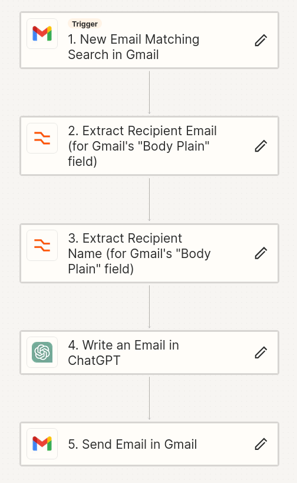

# Customer Support Webpage 🌐

## Overview 👀

This repository contains the code for a customer support webpage, developed as part of a workshop for the W3N event on "ChatGPT in Business." The project demonstrates the practical application of integrating ChatGPT with a customer support system, showcasing how AI can enhance business operations. Built using [Node.js](https://nodejs.org/) for the backend, along with basic HTML, CSS, and JavaScript for the frontend, it provides a platform for users to submit inquiries, which are then forwarded to a specified customer support email address. After the customers inquiry reaches customer support mailbox, Zapier should read the email -> send it to ChatGPT API with a clarifying prompt -> send the ChatGPT generated email back to the customer. 

## Features 🌟

Form for submitting customer inquiries.
Backend server using Node.js and Express.
Email integration for forwarding inquiries to a customer support email.
HTTPS support with SSL/TLS certificates generated by Certbot.

## Installation 🛠️

To run this project locally, follow these steps:

### Clone the Repository:

```bash
git clone https://github.com/h2ving/customersupport.git
```

### Navigate to the Project Directory:

```bash
cd ./customersupport
```

### Install Dependencies:

```bash
npm install
```

### Configure SSL/TLS Certificates:

This project uses HTTPS for secure communication. SSL/TLS certificates are required and can be generated using Certbot.
Follow Certbot's documentation to generate a private key and certificate: [Certbot Instructions](https://letsencrypt.org/getting-started/).
Ensure that the paths to your certificate and private key match those in your server configuration.

```javascript
// key and cert generated with certbot
const privateKey = fs.readFileSync('/etc/letsencrypt/live/iriesphere.eu/privkey.pem', 'utf8');  //change key and cert to the 
const certificate = fs.readFileSync('/etc/letsencrypt/live/iriesphere.eu/cert.pem', 'utf8');  //correct location you  generated your key and credential with certbot
```

### Configure user credentials

Server.js:

```javascript
let transporter = nodemailer.createTransport({
        service: 'gmail',
 auth: {
            user: 'name@gmail.com',             // Your email that will send the inquiry
            pass: 'mmmm pppp qqqq mmmm'         // Password for your email - for gmail the user must have 2-factor authentication to generate that password
        }
    });
```

Server.js:

```javascript
let mailOptions = {
        from: req.body.email,             // Sender's email, taken from the form input
        to: 'customersupport@iriesphere.eu', // Your customer support email where the inquiry will be sent and where it should be processed with zapier
        subject: 'New Customer Inquiry',
        text: `From: ${req.body.name}\nEmail: ${req.body.email}\n\n${req.body.message}`
    };
```

### Docker installation

Build the docker image:

```bash
docker build -t customersupport .
```

### Start the Server:

Without docker:

```bash
node server.js
```

Run the Docker Container with Certbot Volumes:

Ensure that you have generated SSL/TLS certificates using Certbot and know their location on your host machine.

```bash
docker run -p 80:80 -p 443:443 -v /etc/letsencrypt:/etc/letsencrypt:ro -d customersupport
```

This command mounts the /etc/letsencrypt directory from your host to the container.

## Configuration 🔧

The server uses environment variables for sensitive information like email credentials. Make sure to set these up before starting your server.
SSL/TLS certificates: The server expects these to be located at paths specified in the server.js file. Update these paths if your certificates are located elsewhere.
The customer support email used in the server configuration should be integrated with Zapier. Zapier can be configured to read new customer inquiries from this email, use ChatGPT to generate a response, and then send it back to the customer's email.

## Usage 👾

Once the server is running:

Open your web browser and navigate to <http://localhost:80> to access the customer support form.
Alternatively if you configured SSL/TLS certificates you can navigate to <https://localhost:443> to access the customer support form on https.
Fill in the details and hit 'Send' to submit an inquiry.

### Automating Responses with Zapier and ChatGPT

Set up a Zapier workflow that triggers on receiving a new email at the customer support email address.
Configure Zapier to use ChatGPT for generating a response based on the inquiry.
Set up an action in Zapier to send the generated response back to the customer's email address.



## License 📜

This project is licensed under the [MIT License](LICENSE.md).

### Contributors 🤝

h2ving, ecce75
